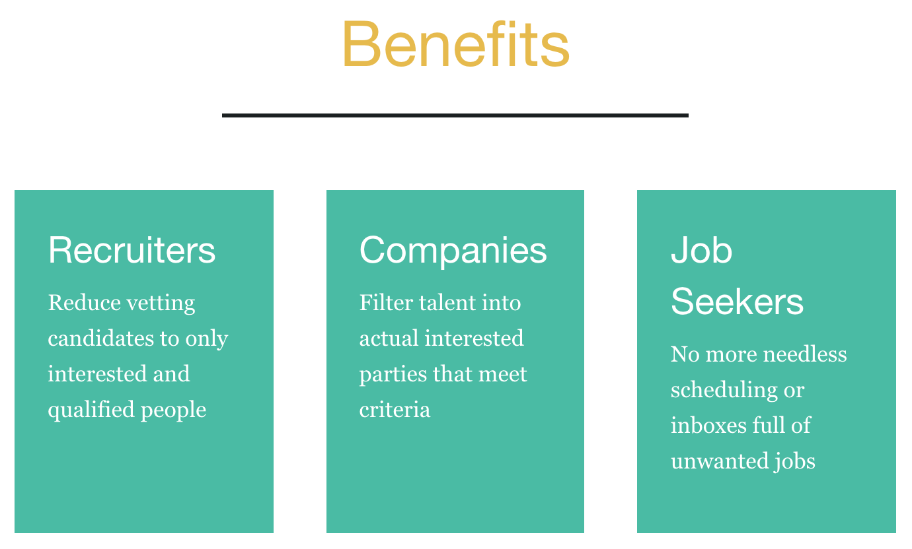

# Rage-Against-The-Recruiters
Tech recruiters overwhelmingly send out “shotgun” blasts of job opportunities to developers without actually confirming that the developer is qualified or even wants the position. Instead of wasting everyone’s time with pointless interviews and shuffling paperwork back and forth only to determine that it was not a good fit…. Why not use a Pre-Screening tool for the developer?

## Benefits of this app:
Saves **EVERYONE** time and effort. No more pointless cover letters, phone interviews, vetting uninterested candidates or getting referrals.

- ### Recruiters
    Reduce vetting candidates to only interested and qualified people
- ### Companies
    Filter talent into actual interested parties that meet criteria
- ### Job Seekers
    No more needless scheduling or inboxes full of unwanted jobs

## Table of Contents
* [How it works](#how-it-works)
* [Features](#features)
* [Technoliges Used](#technologies-used)
* [Contributors](#contributors)
* [Deployed URL](#deployed-url)

## How it works:

- Users are able to create an account with the profile as a recruiter or talent (job seekers).
- Recruiters are able to add to their dashboard different job opportunities that are open by selecting the feature create job opportunities.
- Recruiters then are to fill out a form filling out job details
-The key job details are then saved into the database and used to connect with job seekers.
- Talent is able to browse job details and opportunities the match their criteria. 


## Features:
- User accounts with authentication
- mobile responsive design using foundation
- dynamic generation of content using javascript and sequelize

## Technologies Used:
1. Sequelize
### Example:
```javascript
        questionid_pk: {
            type: DataTypes.INTEGER,
            allowNull: false,
            primaryKey: true,
            autoIncrement: true
        },
        question_category_fk: {
            type: DataTypes.INTEGER,
            allowNull: true,
            foreignKey: true
        },
        answers_fk: {
            type: DataTypes.INTEGER,
            allowNull: true,
            foreignKey: true
        },
        question_type: {
            type: DataTypes.STRING(20),
            allowNull: true
        },
        is_deal_breaker: {
            type: DataTypes.TINYINT,
            allowNull: false,
            defaultValue: 0
        },
        question_text: {
            type: DataTypes.STRING(100),
            allowNull: true
        },
        question_base_score: {
            type: DataTypes.DECIMAL(4, 2),
            allowNull: false,
            defaultValue: 10.00
        },
        sort_order: {
            type: DataTypes.INTEGER,
            allowNull: true
        }
```

2. Passport-Local
### Example:
```javascript
router.post('/login', passport.authenticate('local', { 
  failureRedirect: '/login' 
}),
function(req, res) {
  res.json({ user: req.user })
});
```

3. Foundation
### Example:


## Contributors
[Baron Cannon](https://github.com/BCannon88), [Kat Dixon](https://github.com/TwyllBlackleaf), [Sue Kim](https://github.com/suekimpaulsen), [John Mohlenkamp](https://github.com/Mohlenkamp), and [Deb Orler](https://github.com/dorler).
Please click the name to visit their GitHub.

## Deployed URL
https://ratr20.herokuapp.com/

